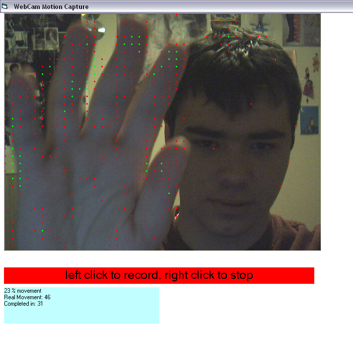



## \[Webcam Motion Detection\]

### Description

This program captures from default camera and detects motion. Its very small code, and i commented all that wasnt common sense. Enjoy and vote =p

Side Note: In case your camera doesnt work too good or properly, start up Movie Maker and it will detect the camera and add it to cameras connected list in windows... then you can use it for sure... sometimes this happens
 
### More Info
 

             |
---                |---
**Submitted On**   |2005-01-21 18:08:50
**By**             |[Mephisto](https://github.com/Planet-Source-Code/PSCIndex/blob/master/ByAuthor/mephisto.md)
**Level**          |Advanced
**User Rating**    |4.6 (129 globes from 28 users)
**Compatibility**  |VB 6\.0
**Category**       |[Coding Standards](https://github.com/Planet-Source-Code/PSCIndex/blob/master/ByCategory/coding-standards__1-43.md)
**World**          |[Visual Basic](https://github.com/Planet-Source-Code/PSCIndex/blob/master/ByWorld/visual-basic.md)
**Archive File**   |[\[Webcam\_Mo1842591212005\.zip](https://github.com/Planet-Source-Code/mephisto-webcam-motion-detection__1-58422/archive/master.zip)

